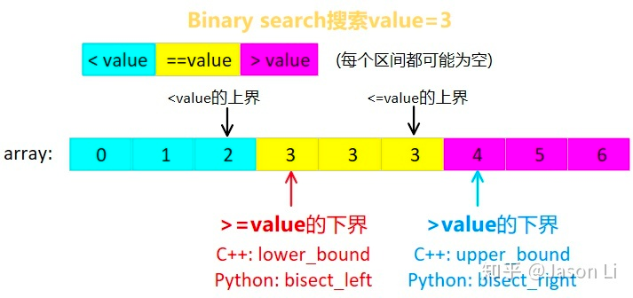
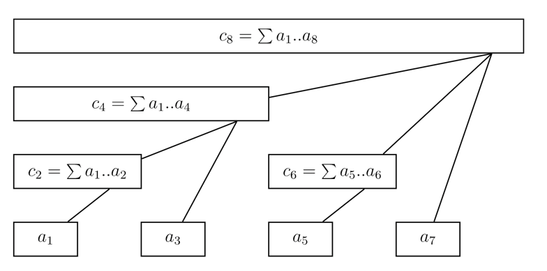
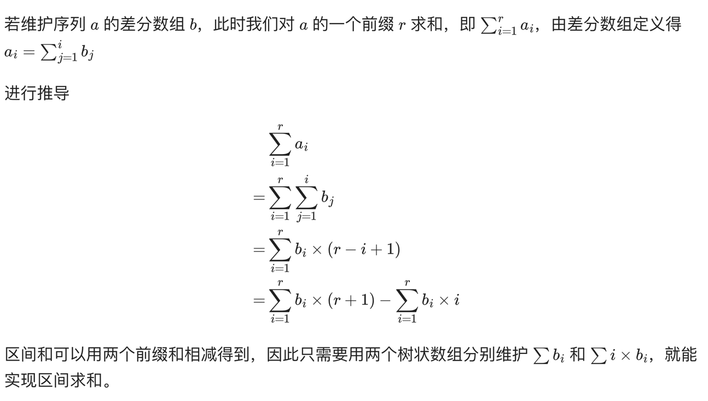

#### top down dp

```python
class Solution:
    dp = {0: 0}

    def topDown(self, i):
        if i in self.dp:
            return self.dp[i]
        self.dp[i] = ...
```

#### log n:

```python
a = 1
n = a.bit_length()
# minimum larger than a:
2 ** n - 1
# maximum smaller than a:
2 ** (n - 1) - 1
```

#### set

literal set(tuple) is immutable declare like following to get a mutable set:

```python
t = set()
```

### Binary Search



#### border case

when to use binary search:

- the answer is an integer or double, don't have to trace the solution
- 目的是要求出某個變數 "滿足某個條件" 的最小值，且變數超出此值後也都會繼續滿足此條件。
- 無法使用有效率的方法計算出答案，但只要給變數任意的值，都能容易的判斷出是否滿足條件。

template:

- when search for minimum
   ```python
    l, r = min, max  # max should be unacceptable or just 0 1000000
    while l < r:
      mid = (l + r) // 2
      success = check(mid) 
      if success: r = mid  # mid is okey and can be smaller
      else: l = mid + 1 # mid is not ok
    ```
- when search for maximum
   ```python
    l, r = min, max  # max should be unacceptable or just 0 1000000
    while l < r:
      mid = (l + r + 1) // 2 # notice !!
      success = check(mid) # ok with mid and larger
      if success: l = mid
      else: r = mid - 1 # mid is not okey
    ```

### classic graph algorithm

BFS should only be used in undirected graph as it can't find circle correctly in directed graph DFS visit graph always use coloring, but it is unnecessary as we can simply use a visited array + back
tracing

### virtual node

virtual head and tail in list questions

### monotonous queue / stack

when it is possible to use monotonous queue / stack, it is also possible to use left / right min/max array

features:

- number goes up and down, and the relative relationship of neighbors matters
- when we visit i, the next sub problem only cares about the next and bigger index, or the next and smaller index, other indexes are useless
- one kind of pre-process
- information of original array is reduced
- time complexity is O(n)

Other:

- we can use sentinel to avoid popping from empty stack

template:

```python
class Solution:
    def monostoneStack(self, T: List[int]) -> List[int]:
        stack = []
        ans = [0] * len(T)
        for i in range(len(T)):
            while stack and T[i] > T[stack[-1]]:
                peek = stack.pop(-1)
                ans[peek] = i - peek
            stack.append(i)
        return ans
```

### 倍增

### ST table and RMQ

RMQ: range min/max query different from sum query: max(a, a) = a, max(a, b) = max(a, a) (b belongs to a)

### 树状数组



#### low bit

low_bit = x & -x

#### 自底向上更新

```python
# Python Version
def add(x, k):
    while x < n:  # 不能越界
        c[x] = c[x] + k
        x = x + lowbit(x)
```

#### 前缀和

```python
# Python Version
def getsum(x: int):  # sum(c[:x])
    ans = 0
    while x != 0:
        ans = ans + c[x]
        x = x - lowbit(x)
    return ans
```

#### 区间加

区间加指对区间 [i,j] 中所有元素值都增加 v 如果没有区间加的需求，不需要维护两个差分数组前缀和


```python
# t1 for sum(bi), t2 for sum(i * bi)
t1, t2, n = [0] * MAXN, [0] * MAXN, MAXN


def low_bit(x: int) -> int:
    return x & -x


def add(k: int, v: int):
    v1 = k * v
    while k <= n:
        t1[k] += v
        t2[k] += v1
        k += low_bit(k)


def add_range(l: int, r: int, v: int):
    add(l, v)
    add(r + 1, -v)


def get_sum(t, k):
    ret = 0
    while k != 0:
        ret += t[k]
        k -= low_bit(k)
    return ret


# prefix sum
def get_sum_range(l, r):
    return (r + 1) * get_sum(t1, r) - l * get_sum(t1, l - 1) -
    get_sum(t2, r) + get_sum(t2, l - 1)
```

### 线段树

#### build tree

```python
def build(nums, d, l, r, p):
    # zero-indexed
    if l == r:
        d[p] = nums[l]
        return
    m = (l + r) // 2
    build(nums, d, l, m, p * 2 + 1)
    build(nums, d, m + 1, r, p * 2 + 2)
    d[p] = d[p * 2 + 1] + d[(p * 2) + 2]


d = [0 for i in range(100)]
nums = []
build(nums, d, 0, 100, 0)
```

#### get range sum

```python
# Python Version
def getsum(l, r, s, t, p, d):
    # [l, r] 为查询区间, [s, t] 为当前节点包含的区间, p 为当前节点的编号
    if l <= s and t <= r:
        return d[p]  # 当前区间为询问区间的子集时直接返回当前区间的和
    m = (l + r) // 2;
    sum = 0
    if l <= m:
        sum += getsum(l, r, s, m, p * 2 + 1, d)
    if r > m:
        sum += getsum(l, r, m + 1, t, p * 2 + 2, d)
    return sum
```

### range modify

```python

```

### 离散化

must get the whole array than deduplicate, sort and binary search the index

### how to solve range in leetcode

### merge list, sort, and split up into lists

```python
jobs = list(zip(startTime, endTime, profit))
jobs.sort(key=lambda x: x[0])
startTime, endTime, profit = list(zip(*jobs))
```

### sugar

```python
collections.Counter(time)  # iterable, return a freq dict
collections.defaultdict(int)  # reference non-existed key return 0, not raise exception
```

### sortedcontainers:

sortedDict sortedList sortedSet can use bisect on keys:

```python
import sortedcontainers

s = sortedcontainers.SortedDict()
idx = s.bisect(key)
# idx to key:
key = s.iloc[idx]
```

### get combination

````python
combinations(range(len(letter)), 2)
````

### sliding window

the size of range of each sub-problem is always fixed

### zip, zip longest

https://stackoverflow.com/questions/1277278/is-there-a-zip-like-function-that-pads-to-longest-length

itertools.zip_longest(a, b, c)

### all
all for all element in a list meet the condition 